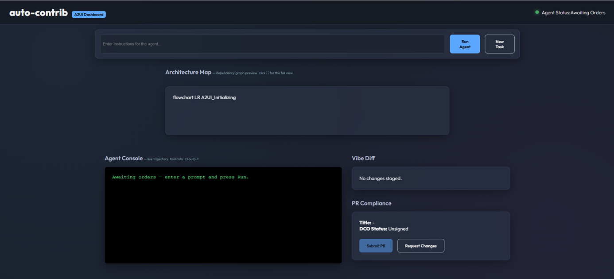
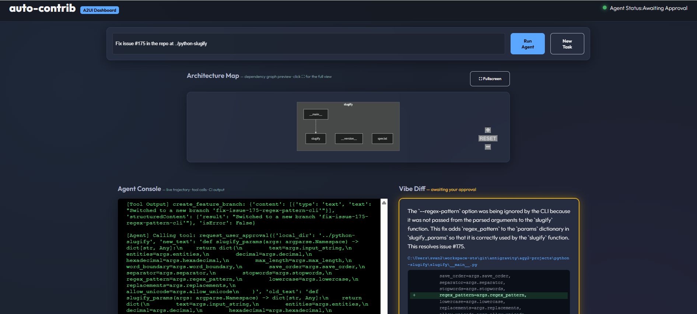

# auto-contrib — An Autonomous, Human-Gated GitHub Contribution Agent

**Kaggle "AI Agents: Intensive Vibe Coding" Capstone**
**Track:** Freestyle
**Team:** 1 ([svetanis](https://github.com/svetanis)) + Claude (Anthropic) as AI pair-programmer
**Built with:** Google ADK · Gemini 2.5 Flash · Model Context Protocol · Agent Skills

🎥 Demo video: https://www.youtube.com/watch?v=sbzLFtCBOos
📦 Project repo: https://github.com/svetanis/auto-contrib
📜 License: [CC BY 4.0](https://creativecommons.org/licenses/by/4.0/)

---

## 1. The Problem & Why It Matters

Contributing to an unfamiliar codebase is slow and intimidating: mapping the
architecture, finding the right file, matching conventions, waiting on CI, and
opening a PR that satisfies the maintainers' template. That friction is why
"good first issues" sit untouched for months, and why engineering teams burn
senior time onboarding people onto code they rarely touch.

**auto-contrib** compresses that loop into a single, supervised session. Given
a repository and a GitHub **issue number** (or a plain bug description), the
agent fetches the issue, maps the architecture, locates the offending code,
creates a feature branch, and proposes a precise fix — then **stops and asks a
human to approve the exact diff** before anything is written or pushed. Once
approved, it commits, pushes, opens a Conventional-Commits pull request, and
polls CI on that PR.

Crucially, it runs against **real open-source repositories**: pointed at a
fork, it auto-detects the upstream parent to read the issue, branches from the
repo's real default branch (`main` or `master`), and opens the PR back to the
fork — the full contribution loop on genuine code, with **no writes to any
upstream repository**.

The value proposition is deliberately narrow: not an autonomous developer, but
a **contribution accelerator with a human in the loop** — the agent handles
navigation and mechanics; the human keeps judgment and authority. This maps to
the Day 4 distinction between *security* ("did the agent stay in bounds?") and
*evaluation* ("was what it did worth shipping?") — answered here by a hard
approval gate plus policy server, and an evaluation suite, respectively.

---

## 2. Architecture Overview

auto-contrib is a single ADK agent (`root_agent`) assembled from three layers
— **Skills** (know-how), **MCP servers** (reach into Git/GitHub and code
analysis), and a **security layer** (policy gate, context hygiene, HITL
approval). A FastAPI app streams the agent's reasoning to a browser dashboard
over Server-Sent Events.

```
User Prompt ("fix the bug in calculator.py at <repo>")
     │
     ▼
auto-contrib Agent  (ADK · Gemini 2.5 Flash, rate-limited)
     │
     ├── Agent Skills  (SkillToolset — progressive disclosure)
     │     ├── architecture-mapper        → triggers on "map / visualize"
     │     ├── code-implementer           → test-aware source-fix workflow
     │     ├── test-debugger              → CI/CD polling loop
     │     └── pr-compliance-formatter    → Conventional Commits PR
     │
     ├── MCP Servers   (McpToolset over SSE — FastMCP)
     │     ├── repo-mapper-mcp  :8002
     │     │     ├── map_architecture     (AST → Mermaid; tests/build filtered)
     │     │     └── semantic_search
     │     └── github-mcp       :8001
     │           ├── get_github_issue     (fork-aware: reads the upstream issue)
     │           ├── read_file
     │           ├── create_feature_branch
     │           ├── push_wip_commit
     │           ├── submit_pull_request
     │           └── poll_github_actions_logs
     │
     ├── Security Layer
     │     ├── Policy Server      (before_tool_callback: structural + keyword + scope)
     │     ├── Context Resolver   (secret/PII masking on issue text + CI logs)
     │     └── HITL Approval Gate (request_user_approval — human-approved diff)
     │
     └── FastAPI + SSE
           ├── POST /api/run       → streams tool calls + live, zoomable Mermaid diagram
           ├── POST /api/approve   → applies edit, pushes the branch
           ├── POST /api/reject    → discards the pending edit
           └── POST /api/submit-pr → opens the PR, then polls CI on it
```

The happy-path trajectory: `get_github_issue` *(when an issue is named)* →
`map_architecture` → `read_file` → `create_feature_branch` →
`request_user_approval` **(pause)** → human approves → edit + push →
`submit_pull_request` → `poll_github_actions_logs`. The PR opens *before* the
CI poll because most repos trigger CI on the `pull_request` event.

---

## 3. Key Concepts Applied

The capstone asks for at least three of six concept areas; auto-contrib
implements **four in working code** — Agent/Multi-agent (ADK), MCP Server,
Agent Skills, Security — plus a fifth (Deployability) via containerization.

### 3.1 Agent / Multi-Agent with ADK (Day 1)

The Day 1 "factory model" says the developer's job is to engineer the harness
— prompts, tools, guardrails — not write code directly. auto-contrib is that
harness: a thin agent whose behavior comes from skills, MCP tools, and policy
callbacks wired in `app/agent.py`.

The workflow decomposes into four skills the model loads on demand (mapper →
implementer → debugger → PR formatter) while keeping one coherent session. A
custom `RateLimitedGemini` wrapper enforces a per-minute budget and, on
overload (503) or quota limits (429), transparently **fails over to a sibling
model** (`gemini-2.5-flash-lite`, then others) — each has its own quota pool,
so one model's limit rarely kills a run (only an exhaustion of every fallback
does).

### 3.2 MCP Server (Days 2 & 5)

auto-contrib ships **two** MCP servers over HTTP/SSE:

- **repo-mapper-mcp** (`:8002`) — `map_architecture` parses a repo (AST for
  Python, heuristics for Java/Go/TypeScript) into a Mermaid **module
  dependency graph**: source modules as nodes, intra-repo imports as edges,
  grouped into package subgraphs, each annotated with its file path.
  Test/build/vendor dirs and `__init__.py` re-export hubs are pruned so the
  real structure shows; `semantic_search` adds keyword retrieval.
- **github-mcp** (`:8001`) — `get_github_issue`, `read_file`,
  `create_feature_branch`, `push_wip_commit`, `submit_pull_request`,
  `poll_github_actions_logs`. `get_github_issue` is fork-aware: it resolves
  the upstream `parent` via the GitHub API when the clone is a fork, since
  forks typically have their own issues disabled — this is what lets the agent
  start from a real issue rather than a hand-fed solution.

The agent consumes both via ADK's `McpToolset` with `SseConnectionParams`.
SSE (not stdio) avoids subprocess-handle issues on Windows; servers start in
background threads when the agent module loads.

### 3.3 Agent Skills (Day 3)

Skills are folders (`SKILL.md` + scripts/examples) implementing *progressive
disclosure* — metadata always in context, body loads only when triggered.
Four skills, loaded via `SkillToolset`:

- **architecture-mapper** — map/visualize a repo.
- **code-implementer** — **test-aware**, not test-first: reads the *existing*
  tests covering the code, then proposes one fix that keeps them passing. It
  does not author a new test file, because the approval gate stages one edit
  per session and fix-plus-new-test is two; authoring a regression test
  alongside the fix is the planned multi-edit (v2) enhancement.
- **test-debugger** — manage the CI/CD polling loop.
- **pr-compliance-formatter** — Conventional Commits + clean PR body.

This is Day 3's "Skills = know-how, MCP = reach" made concrete: MCP can *push
a commit*, but `code-implementer` encodes *when and how* to do so
responsibly. Two of the four skills bundle example resources and helper
scripts that load only on demand.

### 3.4 Security Features (Days 4 & 5)

**HITL Approval Gate.** The agent *cannot* edit a file on its own — the
github-mcp toolset exposes no file-write tool. `request_user_approval`
validates the proposed `old_text` exists, stores the pending edit, and pauses.
Inspired by Day 4's "Vibe Diff" (a plain-English translation of a risky action
before it runs), the browser pairs the agent's plain-English rationale with the
**exact red/green code diff**, and the card glows to signal it's awaiting a
decision. Only on approval does a separate, LLM-free endpoint apply the edit and
push. Authority over *code changes* never leaves the human; branch creation and
PR opening remain agent actions, themselves gated by the policy server.

**Policy Server.** An ADK `before_tool_callback` gates tool calls. Following
Day 5's Policy Server pattern, it layers **structural** checks
(non-empty/non-identical edits, protected branch names, Conventional-Commits
titles) with a **keyword screen** that blocks common destructive disk
operations (`rm -rf /`, `shutil.rmtree`, …) — a deterministic stand-in for
Day 5's LLM-based semantic gate, upgradeable to an LLM classifier without
changing the interface — plus a **write-scope** check that, when an allowlist
is configured, confines writes via `os.path.commonpath`.

**Context Hygiene.** Following Day 5's Context Hygiene pattern (PII masking +
placeholder injection), secrets/PII (GitHub tokens, prefix-anchored vendor API
keys, emails, IPs, SSH keys) are masked into `[[LABEL]]` placeholders before
external text enters the model's context — wired into **both** ingestion paths:
fetched issue text and CI logs. Vendor-key and token patterns are
prefix-anchored so they never swallow commit SHAs or hashes; emails and IPs are
masked wholesale, a deliberate trade-off that occasionally redacts a legitimate
example in issue text.

### 3.5 Deployability (Days 1, 2 & 5)

Container-ready: a `Dockerfile` builds the app; `agents-cli-manifest.yaml`
targets Cloud Run. Since the capstone needs three concept areas and four are
already met in code, deployability is shown as packaging readiness rather
than a hosted URL — an honest scoping choice for a single-session,
human-gated design.

---

## 4. Demo Walkthrough

🎥 Watch the recorded demo: https://www.youtube.com/watch?v=sbzLFtCBOos

The recorded demo runs against a **real PyPI library** — a fork of
`python-validators/validators` ([svetanis/validators](https://github.com/svetanis/validators))
with a genuine open issue (#413, *"`hostname()` lets long hostnames through if
they contain periods"*). Two other real runs back it up: **`python-slugify`
#175** ([svetanis/python-slugify](https://github.com/svetanis/python-slugify)),
and a controlled sandbox
([svetanis/auto-contrib-sandbox](https://github.com/svetanis/auto-contrib-sandbox))
used for fast, **symptom-driven** regression runs — no issue number at all.



0. **Fetch the issue.** The user enters *"Fix issue #413 in the repo at
   ../validators"*. The agent calls `get_github_issue`; the clone is a fork,
   so it auto-detects `python-validators/validators` and returns a one-line
   repro: a 256-character hostname slipping past validation. The agent has
   the symptom, not a solution.
1. **Map.** `map_architecture` returns a live dependency graph, zoomable with
   a **⛶ fullscreen** view. With tests, build dirs, and `__init__.py` hubs
   filtered out, it shows how the ~30-module package fits together: `utils`
   is the shared core, and `hostname` builds on `domain` and `ip_address` —
   the very edges behind issue #413.
2. **Locate & diagnose.** `read_file` on `hostname.py` (and `domain.py`)
   reveals the bug: `hostname()` never checks total length, so a long,
   multi-label name passes each 63-char label check while exceeding the RFC
   limit overall.
3. **Branch.** `create_feature_branch` forks from the real default branch
   (`master`, resolved from `origin/HEAD`) and fast-forwards it first.
4. **Propose & pause.** `request_user_approval` presents the rationale and a
   one-line diff (`if not value:` → `if not value or len(value) > 255:`). The
   Vibe Diff card glows amber and renders the exact red/green diff.
5. **Approve & push.** The LLM-free `/api/approve` endpoint applies the
   edit, commits, and pushes.
6. **PR & CI.** **Submit PR** opens
   [PR #1](https://github.com/svetanis/validators/pull/1) — base
   auto-detected (`master`), body from auto-contrib's default template. CI
   (gated on the `pull_request` event) runs the suite across **five Python
   versions (3.10–3.14)** plus **Bandit**, a **SAST** scan, and a **tooling/lint**
   check — all eight checks pass.

One honest note: no *existing* test covered the >255-length case, so green CI
proves the fix didn't break anything, not that a regression test locks it in
— the "test-aware, not test-first" boundary from §3.3.

The `python-slugify` #175 run followed the identical trajectory on a
different repo (the CLI never forwarded `--regex-pattern` to `slugify()`) and
also finished green, confirming the flow generalizes.



The sandbox `Calculator` repo confirms the loop without any issue number: a
plain symptom ("the `add()` method is broken") produced a real,
human-approved PR
([#3](https://github.com/svetanis/auto-contrib-sandbox/pull/3)) — and since
this repo *does* ship its own PR template, `submit_pull_request` correctly
filled that one instead of the default, exercising both branches of the
template logic in §3.2. More screenshots (fullscreen map, PR pages, CI runs)
are in the [project README](https://github.com/svetanis/auto-contrib#screenshots).

---

## 5. Evaluation

Drawing on Day 3's evaluation toolkit — a **Golden Dataset** and trajectory
scoring — auto-contrib ships an `evals/` suite driven by a golden dataset of
five scenarios (Java, TypeScript, Go, Python, Markdown). It scores:

- **Trajectory quality** — correct tool order (`map_architecture` →
  `read_file` → `create_feature_branch` → `request_user_approval`), with an
  ordering bonus.
- **PR compliance** — fractional credit for matching expected files, plus a
  Conventional-Commits title check.

A `generate_llm_judge_prompt` helper produces an LLM-as-a-judge prompt for
semantic scoring ("did the agent fix the root cause securely?"). The runner
executes each scenario against the live agent, so evaluation is connected to
real runs.

---

## 6. Engineering Discipline & Honest Limitations

In the spirit of Day 5 ("Vibe Coding is not Vibe-in-Production"):

- **PRs open within the fork, not upstream** — deliberately, so the demo
  writes to no upstream repository. Cross-fork PRs to the original repo are a
  proposed v2 enhancement, left unbuilt because opening a PR on a third party's
  repo needs an explicit opt-in and live testing first.
- **Fixes are a single contiguous block.** The approval gate reviews one
  diff per session — right for focused fixes, not multi-file refactors. Some
  bugs legitimately span non-adjacent functions (a finance-validator issue we
  tested needed both a checksum helper and its caller's format guard); this
  is a limit of the **gate**, not the model — in our tests the LLM proposed
  coherent multi-function fixes the gate couldn't stage. Multi-edit support (a
  list of edits, applied atomically) is a scoped v2 enhancement, not an
  architecture change.
- **Session state is single-user** — process-scoped, correct for the
  supervised demo but needs per-session keying before multi-tenant hosting.
- **HITL uses a pause-and-resume exception** caught by the API layer;
  reliable, but a candidate for ADK's native interrupt mechanism as it
  matures.

These are documented, not hidden — the rubric rewards knowing where the
bounds are.

---

## 7. Summary

auto-contrib turns contributing a fix to an unfamiliar repository into a
single supervised session, without surrendering human authority — on
**genuine open-source repos**, from a **real issue number**. It applies the
capstone's concepts as working software: an ADK agent orchestrating **two MCP
servers**, **four Agent Skills**, a **policy server**, **context-hygiene
masking**, and a **human approval checkpoint**, with a **connected evaluation
suite** and a **container-ready deployment** path. The
harness — tools, skills, and guardrails engineered around the model — is what
makes an agent trustworthy.

---

*Demo video: https://www.youtube.com/watch?v=sbzLFtCBOos — recorded against
`python-validators/validators` issue #413. Artifact: PR
https://github.com/svetanis/validators/pull/1, green across all eight checks
(5 Python versions, Bandit, SAST, tooling). A second real-repo run
(`python-slugify` #175) and a sandbox regression run are referenced in §4.*
