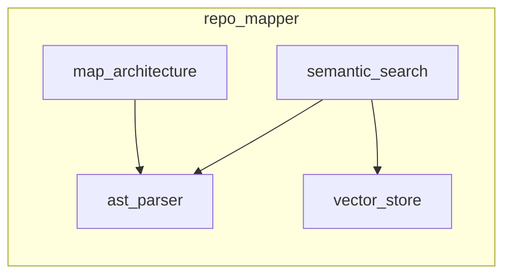

# Architecture Map Example

Below is the generated module **dependency graph** for the requested codebase.
Nodes are source modules (grouped into package subgraphs); edges are intra-repo
imports, so you can see how the code fits together at a glance:

Reading it: `map_architecture` and `semantic_search` both build on `ast_parser`
(the shared parsing core), while `semantic_search` additionally depends on
`vector_store`. Isolated nodes with no edges are modules that import nothing else
in the repo — that is expected, not an error.
