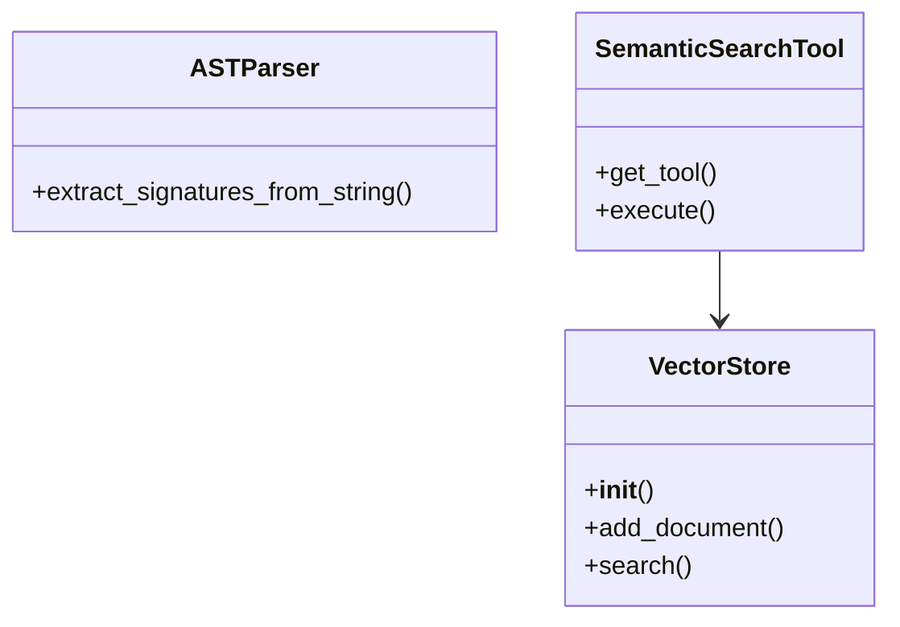

# Architecture Map Example

Below is the generated class diagram for the requested codebase architecture:

```mermaid
classDiagram
  class ASTParser {
    +extract_signatures_from_string()
  }
  class VectorStore {
    +__init__()
    +add_document()
    +search()
  }
  class SemanticSearchTool {
    +get_tool()
    +execute()
  }
  
  SemanticSearchTool --> VectorStore
```
